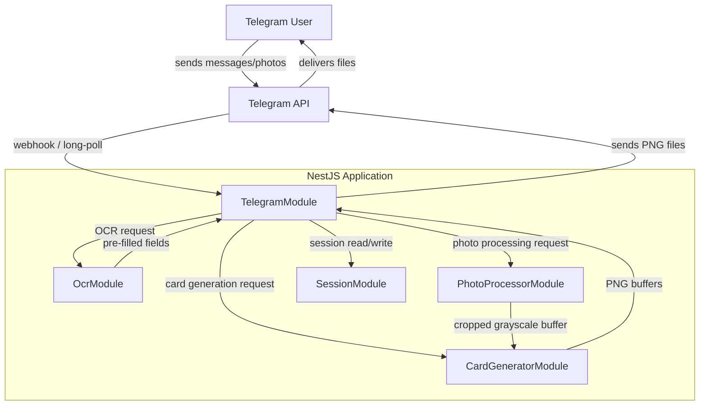
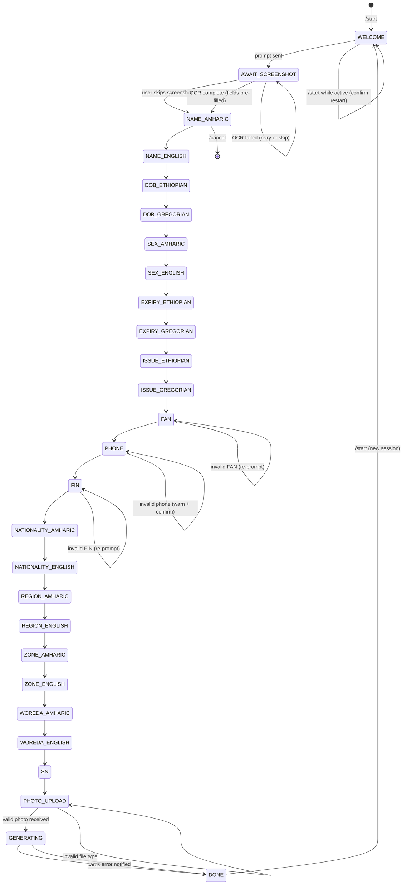
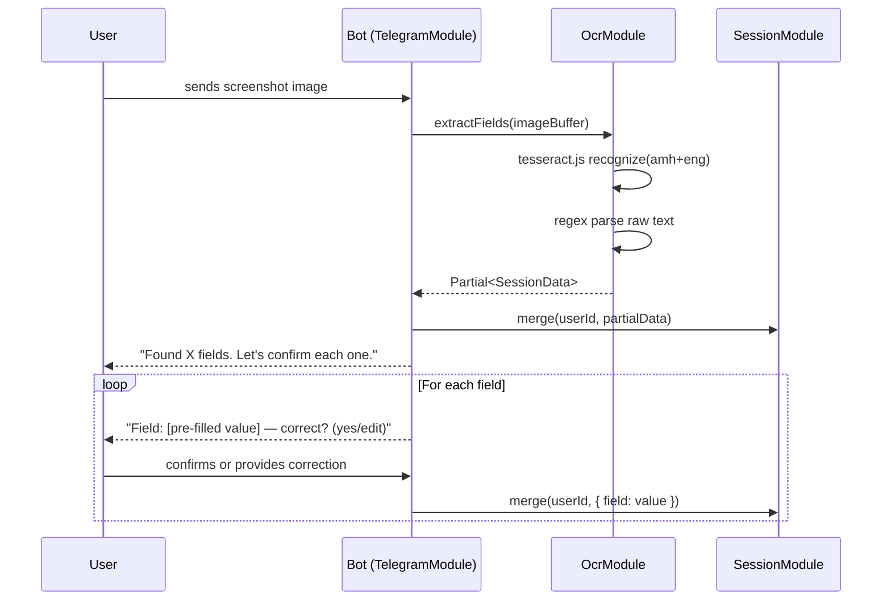
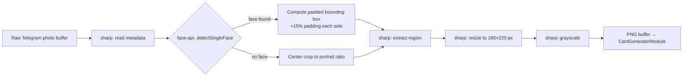

# Design Document: Fayda ID Reconstruction Bot

## Overview

The Fayda ID Reconstruction Bot is a Telegram bot built with NestJS and Telegraf that guides users through a multi-step conversation to collect all fields needed to reconstruct a printable Ethiopian Fayda Digital ID card. The bot optionally accepts a screenshot of the Fayda app and uses OCR (tesseract.js) to pre-fill fields, then confirms each field with the user, processes a portrait photo through face detection and grayscale conversion, and finally composites both the front and back card as PNG images using node-canvas.

Key design decisions:
- NestJS provides a structured, modular DI framework well-suited to a multi-service bot
- Telegraf's scene/stage system maps cleanly to the multi-step conversation state machine
- tesseract.js with amh+eng language pack enables Amharic OCR without a Python dependency
- @vladmandic/face-api provides in-process face detection without an external API call
- node-canvas gives pixel-accurate compositing with full font and image support
- All processing is in-process (no external microservices), keeping deployment to a single Docker container


## Architecture



### Request Flow Summary

1. User sends `/start` → TelegramModule initialises a Telegraf scene
2. User optionally sends a Fayda app screenshot → OcrModule extracts fields → scene pre-fills prompts
3. Scene walks through each field prompt, one per message, confirming or correcting pre-filled values
4. After all text fields, user uploads portrait photo → PhotoProcessorModule detects face, crops, grayscales
5. CardGeneratorModule composites front and back PNGs
6. TelegramModule sends both PNGs (and optional PDF) back to the user
7. SessionModule clears session data


## Components and Interfaces

### TelegramModule

Responsibilities:
- Bootstrap Telegraf bot with token from environment
- Register Telegraf Stage with all conversation scenes
- Route incoming updates to the correct scene
- Orchestrate calls to OcrModule, PhotoProcessorModule, CardGeneratorModule
- Send output files back to the user

Key classes:
- `TelegramService` — wraps Telegraf bot instance, exposes `launch()` and `stop()`
- `BotUpdate` (Telegraf update handler) — registers middleware and scene entry points
- `ConversationScene` — Telegraf `Scenes.WizardScene` implementing the full field-collection flow

```typescript
interface ConversationScene {
  // Each step handler receives ctx: WizardContext
  handleStart(ctx): Promise<void>
  handleOcrScreenshot(ctx): Promise<void>
  handleFieldInput(ctx, fieldKey: FieldKey): Promise<void>
  handlePhotoUpload(ctx): Promise<void>
  handleGenerateCards(ctx): Promise<void>
}
```

### OcrModule

Responsibilities:
- Accept an image buffer
- Run tesseract.js with `amh+eng` language pack
- Parse the raw OCR text to extract known Fayda field patterns
- Return a partial `SessionData` object with any fields found

```typescript
interface OcrService {
  extractFields(imageBuffer: Buffer): Promise<Partial<SessionData>>
}
```

OCR field extraction uses regex patterns against the raw text output:
- FAN: `/\b\d{16}\b/`
- FIN: `/FIN\s+[A-Z0-9]{8}\s+[A-Z0-9]{4}/i`
- Phone: `/0[79]\d{8}/`
- Dates: Ethiopian and Gregorian date patterns

### PhotoProcessorModule

Responsibilities:
- Accept a raw photo buffer from Telegram
- Run @vladmandic/face-api to detect the primary face bounding box
- Use sharp to crop to the face region with configurable padding
- Resize to the card portrait dimensions (180×220 px at card resolution)
- Convert to grayscale
- Return the processed buffer

```typescript
interface PhotoProcessorService {
  processPortrait(rawBuffer: Buffer): Promise<Buffer>
}
```

Processing pipeline:
1. `sharp(buffer).metadata()` — get dimensions
2. `faceapi.detectSingleFace(tensor)` — get bounding box
3. `sharp(buffer).extract(paddedBox).resize(180, 220).grayscale().png().toBuffer()`
4. If no face detected, fall back to center-crop + resize

### CardGeneratorModule

Responsibilities:
- Accept a complete `SessionData` object and the processed portrait buffer
- Load background assets (bg_front.png, bg_back.png, eth_flag.png, national_id_logo.png)
- Register fonts (NotoSansEthiopic, Roboto)
- Composite all elements onto node-canvas canvases
- Return front and back PNG buffers
- Optionally combine into a two-page PDF

```typescript
interface CardGeneratorService {
  generateFront(session: SessionData, portrait: Buffer): Promise<Buffer>
  generateBack(session: SessionData): Promise<Buffer>
  generatePdf(front: Buffer, back: Buffer): Promise<Buffer>
}
```

### SessionModule

Responsibilities:
- Maintain an in-memory Map keyed by Telegram user ID
- Provide typed get/set/delete operations
- Auto-expire sessions after a configurable TTL (default 30 minutes)

```typescript
interface SessionService {
  get(userId: number): SessionData | undefined
  set(userId: number, data: Partial<SessionData>): void
  delete(userId: number): void
  merge(userId: number, partial: Partial<SessionData>): void
}
```


## Data Models

### SessionData

```typescript
interface SessionData {
  // Front card fields
  nameAmharic: string          // e.g. "አበበ ቢቂላ"
  nameEnglish: string          // e.g. "Abebe Bikila"
  dobEthiopian: string         // DD/MM/YYYY
  dobGregorian: string         // YYYY/Mon/DD  e.g. "1932/Aug/07"
  sexAmharic: string           // "ወንድ" | "ሴት"
  sexEnglish: string           // "Male" | "Female"
  expiryEthiopian: string      // YYYY/MM/DD
  expiryGregorian: string      // YYYY/Mon/DD
  issueEthiopian: string       // YYYY/MM/DD
  issueGregorian: string       // YYYY/Mon/DD
  fan: string                  // 16-digit numeric string

  // Back card fields
  phone: string                // 10-digit, starts with 09 or 07
  fin: string                  // "FIN XXXXXXXX XXXX"
  nationalityAmharic: string   // e.g. "ኢትዮጵያ"
  nationalityEnglish: string   // e.g. "Ethiopian"
  regionAmharic: string
  regionEnglish: string
  zoneAmharic: string
  zoneEnglish: string
  woredaAmharic: string
  woredaEnglish: string
  sn: string                   // "SN: XXXXXXX"

  // Photo
  portraitBuffer?: Buffer      // raw Telegram photo download
  processedPortrait?: Buffer   // face-cropped, grayscale, resized

  // Metadata
  step: ConversationStep
  ocrAttempted: boolean
  createdAt: Date
}
```

### ConversationStep (state machine states)

```typescript
enum ConversationStep {
  WELCOME = 'WELCOME',
  AWAIT_SCREENSHOT = 'AWAIT_SCREENSHOT',
  NAME_AMHARIC = 'NAME_AMHARIC',
  NAME_ENGLISH = 'NAME_ENGLISH',
  DOB_ETHIOPIAN = 'DOB_ETHIOPIAN',
  DOB_GREGORIAN = 'DOB_GREGORIAN',
  SEX_AMHARIC = 'SEX_AMHARIC',
  SEX_ENGLISH = 'SEX_ENGLISH',
  EXPIRY_ETHIOPIAN = 'EXPIRY_ETHIOPIAN',
  EXPIRY_GREGORIAN = 'EXPIRY_GREGORIAN',
  ISSUE_ETHIOPIAN = 'ISSUE_ETHIOPIAN',
  ISSUE_GREGORIAN = 'ISSUE_GREGORIAN',
  FAN = 'FAN',
  PHONE = 'PHONE',
  FIN = 'FIN',
  NATIONALITY_AMHARIC = 'NATIONALITY_AMHARIC',
  NATIONALITY_ENGLISH = 'NATIONALITY_ENGLISH',
  REGION_AMHARIC = 'REGION_AMHARIC',
  REGION_ENGLISH = 'REGION_ENGLISH',
  ZONE_AMHARIC = 'ZONE_AMHARIC',
  ZONE_ENGLISH = 'ZONE_ENGLISH',
  WOREDA_AMHARIC = 'WOREDA_AMHARIC',
  WOREDA_ENGLISH = 'WOREDA_ENGLISH',
  SN = 'SN',
  PHOTO_UPLOAD = 'PHOTO_UPLOAD',
  GENERATING = 'GENERATING',
  DONE = 'DONE',
}
```

### Validation Rules

| Field | Rule |
|-------|------|
| FAN | Exactly 16 digits `/^\d{16}$/` |
| Phone | `/^0[79]\d{8}$/` |
| FIN | `/^FIN\s+[A-Z0-9]{8}\s+[A-Z0-9]{4}$/i` |
| SN | `/^SN:\s*\w+$/i` |
| Ethiopian date | `/^\d{2}\/\d{2}\/\d{4}$/` or `/^\d{4}\/\d{2}\/\d{2}$/` |
| Gregorian date | `/^\d{4}\/[A-Za-z]{3}\/\d{2}$/` |


## Conversation Flow State Machine



### OCR Pre-fill Flow




## Photo Processing Pipeline



### Face Detection Details

- Model: `@vladmandic/face-api` SSD MobileNet V1 (lightweight, runs in Node.js)
- Models loaded from `assets/face-api-models/` at startup
- Input: sharp-decoded pixel buffer converted to a `tf.Tensor3D`
- Output: `{ x, y, width, height }` bounding box in pixels
- Padding: expand each side by 15% of the box dimension (clamped to image bounds)
- Fallback: if detection score < 0.5 or no face found, use center-crop to 3:4 aspect ratio

### Portrait Dimensions on Card

- Card resolution: 1012 × 638 px (CR80 at ~96 DPI equivalent for screen; use 300 DPI for print)
- Portrait box on front card: 180 × 220 px, positioned at x=30, y=120


## Card Rendering Pipeline

### Canvas Setup

- Canvas size: 1012 × 638 px (both front and back)
- All coordinates below are in pixels at this resolution
- Fonts registered via `registerFont()` before any canvas is created

### Front Card Layout

```
┌─────────────────────────────────────────────────────────────────────────────────┐
│  [eth_flag 60×40]  "የኢትዮጵያ ዲጂታል መታወቂያ ካርድ / Ethiopian Digital ID Card"  [logo 60×60] │  y=15–75
│                    (NotoSansEthiopic-Bold 14px, center)                          │
├──────────────────────────────────────────────────────────────────────────────────┤
│                                                                                  │
│  ┌──────────┐   "FAYDA DIGITAL COPY" watermark (Roboto-Bold 48px, gray 30% α)   │
│  │          │                                                                    │
│  │ Portrait │   Full Name (Amharic) — NotoSansEthiopic-Bold 16px   x=230 y=130  │
│  │ 180×220  │   Full Name (English) — Roboto-Regular 14px          x=230 y=155  │
│  │ x=30     │                                                                    │
│  │ y=120    │   Date of Birth:                                                   │
│  │          │     Label — Roboto-Bold 11px                         x=230 y=185  │
│  │          │     Ethiopian — NotoSansEthiopic-Regular 12px        x=230 y=200  │
│  │          │     Gregorian  — Roboto-Regular 12px                 x=380 y=200  │
│  └──────────┘                                                                    │
│               Sex:                                                               │
│                 Label — Roboto-Bold 11px                           x=230 y=230  │
│                 Amharic — NotoSansEthiopic-Regular 12px            x=230 y=245  │
│                 English — Roboto-Regular 12px                      x=380 y=245  │
│                                                                                  │
│               Date of Expiry:                                                    │
│                 Label — Roboto-Bold 11px                           x=230 y=275  │
│                 Ethiopian — NotoSansEthiopic-Regular 12px          x=230 y=290  │
│                 Gregorian  — Roboto-Regular 12px                   x=380 y=290  │
│                                                                                  │
│               Date of Issue (rotated 90°, right edge)              x=985 y=320  │
│                                                                                  │
├──────────────────────────────────────────────────────────────────────────────────┤
│  [Code 128 barcode — bwip-js, 600×60 px]                           x=206 y=560  │
│  FAN number text — Roboto-Regular 11px, centered below barcode     y=628        │
└──────────────────────────────────────────────────────────────────────────────────┘
```

### Back Card Layout

```
┌─────────────────────────────────────────────────────────────────────────────────┐
│  [eth_flag]  "የኢትዮጵያ ዲጂታል መታወቂያ ካርድ / Ethiopian Digital ID Card"  [logo]        │  y=15–75
├──────────────────────────────────────────────────────────────────────────────────┤
│                                                          ┌──────────────────┐   │
│  Phone Number:                                           │                  │   │
│    Label — Roboto-Bold 11px                 x=30 y=100  │   QR Code        │   │
│    Value — Roboto-Regular 12px              x=30 y=115  │   200×200 px     │   │
│                                                          │   x=780 y=100    │   │
│  FIN:                                                    │                  │   │
│    Label — Roboto-Bold 11px                 x=30 y=145  └──────────────────┘   │
│    Value — Roboto-Regular 12px              x=30 y=160                          │
│                                                                                  │
│  Nationality:                                                                    │
│    Label — Roboto-Bold 11px                 x=30 y=190                          │
│    Amharic — NotoSansEthiopic-Regular 12px  x=30 y=205                          │
│    English — Roboto-Regular 12px            x=180 y=205                         │
│                                                                                  │
│  Address:                                                                        │
│    Region  (Amharic + English)              x=30 y=235 / x=180 y=235           │
│    Zone    (Amharic + English)              x=30 y=265 / x=180 y=265           │
│    Woreda  (Amharic + English)              x=30 y=295 / x=180 y=295           │
│                                                                                  │
├──────────────────────────────────────────────────────────────────────────────────┤
│  SN number — Roboto-Regular 10px                         x=820 y=620            │
│  Footer: "If found, please return to..." — Roboto-Regular 9px  x=30 y=620      │
└──────────────────────────────────────────────────────────────────────────────────┘
```

### Rendering Steps (CardGeneratorService)

1. `createCanvas(1012, 638)` — create canvas
2. `drawImage(bgImage, 0, 0, 1012, 638)` — draw background
3. Draw header: flag, title text, logo
4. (Front only) Draw watermark text with low alpha
5. (Front only) `drawImage(portraitImage, 30, 120, 180, 220)` — composite portrait
6. Draw all text fields using correct font/size/position
7. (Front only) Generate barcode via `bwip-js.toBuffer({ bcid: 'code128', text: fan })`, draw onto canvas
8. (Back only) Generate QR code via `qrcode.toBuffer(fin)`, draw onto canvas
9. `canvas.toBuffer('image/png')` — export PNG


## Asset Requirements

All assets must be placed in the `assets/` directory before running the bot.

| File | Description | Required |
|------|-------------|----------|
| `assets/bg_front.png` | Front card background with green guilloche pattern | Yes |
| `assets/bg_back.png` | Back card background | Yes |
| `assets/eth_flag.png` | Ethiopian flag PNG, ~60×40 px | Yes |
| `assets/national_id_logo.png` | Circular National ID logo, ~60×60 px | Yes |
| `assets/fonts/NotoSansEthiopic-Regular.ttf` | Amharic regular font | Yes |
| `assets/fonts/NotoSansEthiopic-Bold.ttf` | Amharic bold font | Yes |
| `assets/fonts/Roboto-Regular.ttf` | Latin regular font | Yes |
| `assets/fonts/Roboto-Bold.ttf` | Latin bold font | Yes |
| `assets/face-api-models/` | face-api SSD MobileNet V1 model weights | Yes |

The face-api model files can be downloaded from the `@vladmandic/face-api` package's `model/` directory:
- `ssd_mobilenetv1_model-weights_manifest.json`
- `ssd_mobilenetv1_model-shard1`


## Docker Setup

### Dockerfile

```dockerfile
FROM node:20-alpine

# Install node-canvas system dependencies
RUN apk add --no-cache \
    cairo-dev pango-dev libjpeg-turbo-dev giflib-dev \
    librsvg-dev pixman-dev python3 make g++

WORKDIR /app

COPY package*.json ./
RUN npm ci

COPY . .
RUN npm run build

# Assets must be mounted or copied in
EXPOSE 3000

CMD ["node", "dist/main.js"]
```

### docker-compose.yml

```yaml
version: '3.9'
services:
  bot:
    build: .
    restart: unless-stopped
    environment:
      - TELEGRAM_BOT_TOKEN=${TELEGRAM_BOT_TOKEN}
      - NODE_ENV=production
    volumes:
      - ./assets:/app/assets:ro
```

### Environment Variables

| Variable | Required | Description |
|----------|----------|-------------|
| `TELEGRAM_BOT_TOKEN` | Yes | Bot token from BotFather |
| `NODE_ENV` | No | `production` or `development` (default: `development`) |
| `SESSION_TTL_MINUTES` | No | Session expiry in minutes (default: `30`) |
| `LOG_LEVEL` | No | `info`, `debug`, `error` (default: `info`) |
| `POLLING_TIMEOUT` | No | Telegraf long-poll timeout in seconds (default: `30`) |


## Setup Guide

### 1. Create a Telegram Bot

1. Open Telegram and search for `@BotFather`
2. Send `/newbot` and follow the prompts (choose a name and username)
3. BotFather will reply with your bot token — copy it

### 2. Clone and Configure

```bash
git clone <repo-url>
cd fayda-id-reconstruction-bot
cp .env.example .env
# Edit .env and set TELEGRAM_BOT_TOKEN=<your token>
```

### 3. Place Asset Files

Copy the required asset files into the `assets/` directory:

```
assets/
├── bg_front.png
├── bg_back.png
├── eth_flag.png
├── national_id_logo.png
├── fonts/
│   ├── NotoSansEthiopic-Regular.ttf
│   ├── NotoSansEthiopic-Bold.ttf
│   ├── Roboto-Regular.ttf
│   └── Roboto-Bold.ttf
└── face-api-models/
    ├── ssd_mobilenetv1_model-weights_manifest.json
    └── ssd_mobilenetv1_model-shard1
```

Download NotoSansEthiopic from [Google Fonts](https://fonts.google.com/noto/specimen/Noto+Sans+Ethiopic) and Roboto from [Google Fonts](https://fonts.google.com/specimen/Roboto).

Download face-api models:
```bash
npx @vladmandic/face-api --models assets/face-api-models
# or copy from node_modules/@vladmandic/face-api/model/
```

### 4. Deploy

```bash
docker compose up -d
```

Check logs:
```bash
docker compose logs -f bot
```

### 5. Local Development (without Docker)

```bash
npm install
npm run start:dev
```

Requires: Node.js 20+, and the canvas system libraries installed locally (see Dockerfile for the list).


## Correctness Properties

*A property is a characteristic or behavior that should hold true across all valid executions of a system — essentially, a formal statement about what the system should do. Properties serve as the bridge between human-readable specifications and machine-verifiable correctness guarantees.*

### Property 1: Cancel clears session at any step

*For any* active session at any conversation step, issuing `/cancel` should result in the session store containing no data for that user ID.

**Validates: Requirements 1.2, 8.2**

---

### Property 2: State machine advances in correct field order

*For any* valid user input at a given conversation step, the next step should be exactly the successor defined in the `ConversationStep` enum sequence — no steps are skipped or repeated out of order.

**Validates: Requirements 2.1, 3.1**

---

### Property 3: FAN validation rejects non-16-digit strings

*For any* string that is not exactly 16 consecutive digits, the FAN validator should return an error and the session FAN field should remain unchanged.

**Validates: Requirements 2.2**

---

### Property 4: Date validation rejects unrecognized formats

*For any* string that does not match the expected Ethiopian or Gregorian date pattern for the current field, the date validator should return an error and the session date field should remain unchanged.

**Validates: Requirements 2.3**

---

### Property 5: Phone validation warns on non-Ethiopian format

*For any* string that does not match `/^0[79]\d{8}$/`, the phone validator should return a warning result (not a hard rejection), allowing the user to confirm or re-enter.

**Validates: Requirements 3.2**

---

### Property 6: FIN validation rejects malformed values

*For any* string that does not match `/^FIN\s+[A-Z0-9]{8}\s+[A-Z0-9]{4}$/i`, the FIN validator should return an error and the session FIN field should remain unchanged.

**Validates: Requirements 3.3**

---

### Property 7: Photo upload triggers processing and session storage

*For any* valid image buffer sent as a Telegram photo, after processing the session should contain a non-null `processedPortrait` buffer.

**Validates: Requirements 4.2**

---

### Property 8: Non-portrait photos are corrected to portrait orientation

*For any* image where width >= height (landscape or square), the photo processor output should have height > width (portrait orientation).

**Validates: Requirements 4.4**

---

### Property 9: Generated cards meet minimum resolution

*For any* complete `SessionData`, both the front and back card PNG buffers should decode to images with width >= 1012 px and height >= 638 px.

**Validates: Requirements 5.1, 6.1**

---

### Property 10: Front card contains all session text fields

*For any* complete `SessionData`, the rendered front card PNG should contain composited text for all front-card fields (name, dates, sex, FAN barcode).

**Validates: Requirements 5.2, 5.3, 5.4, 5.5**

---

### Property 11: Back card contains all session text fields

*For any* complete `SessionData`, the rendered back card PNG should contain composited content for all back-card fields (phone, FIN, nationality, address, SN, QR code).

**Validates: Requirements 6.2**

---

### Property 12: QR code encodes FIN round-trip

*For any* valid FIN string, generating a QR code from it and then decoding the QR code should produce the original FIN string.

**Validates: Requirements 6.3**

---

### Property 13: Session isolation across users

*For any* two distinct Telegram user IDs, writing session data for one user ID should not affect the session data retrievable for the other user ID.

**Validates: Requirements 8.1**

---

### Property 14: Completed session is fully cleared

*For any* session that transitions to `DONE` or is cancelled, querying the session store for that user ID should return `undefined`.

**Validates: Requirements 8.2**

---

### Property 15: Active session retains all entered fields

*For any* sequence of valid field inputs during an active session, each previously entered field should remain retrievable from the session store until the session ends.

**Validates: Requirements 8.3**

---

### Property 16: Step transitions are logged at INFO level

*For any* conversation step transition, the logger should emit exactly one INFO-level entry containing the user ID and the step name, and that entry should not contain any user-supplied field value.

**Validates: Requirements 10.1, 10.3**

---

### Property 17: Unhandled exceptions are logged at ERROR level

*For any* exception thrown during request handling, the logger should emit an ERROR-level entry containing the stack trace.

**Validates: Requirements 10.2**


## Error Handling

### Startup Errors

- If `TELEGRAM_BOT_TOKEN` is not set, the app logs `FATAL: TELEGRAM_BOT_TOKEN is not set` and exits with code 1
- If required asset files are missing at startup, the app logs which files are missing and exits with code 1
- If face-api models fail to load, the app logs a warning and falls back to center-crop mode (non-fatal)

### Runtime Errors

| Scenario | Handling |
|----------|----------|
| OCR fails or returns no fields | Log warning, skip pre-fill, continue to manual entry |
| Face detection finds no face | Fall back to center-crop, continue |
| Photo download from Telegram fails | Notify user, re-prompt for photo |
| Card generation throws | Log ERROR with stack trace, notify user with "Generation failed, please try /start again" |
| Telegram API send fails | Retry once after 2s, then notify user |
| Session TTL expires mid-conversation | Notify user "Session expired, please /start again", clear session |
| User sends unexpected message type | Notify user of expected input type, re-prompt current step |

### Global Exception Filter

A NestJS `ExceptionFilter` catches all unhandled exceptions:
1. Logs full stack trace at ERROR level (no user field values)
2. Sends a generic error message to the user via Telegraf context if available
3. Clears the user's session to prevent stuck state


## Testing Strategy

### Dual Testing Approach

Both unit tests and property-based tests are required. They are complementary:
- Unit tests catch concrete bugs at specific inputs and integration points
- Property-based tests verify universal correctness across the full input space

### Unit Tests

Focus areas:
- Specific examples of valid and invalid field inputs (FAN, FIN, phone, dates)
- Integration between ConversationScene and SessionModule (step transitions)
- Card generator output for a known fixture `SessionData` (snapshot test)
- `/start` welcome message content
- `/help` command response content
- `/start` while session active — confirmation prompt
- Startup validation: missing `TELEGRAM_BOT_TOKEN` exits with code 1
- Post-delivery session cleanup

### Property-Based Tests

Library: **fast-check** (TypeScript-native, well-maintained)

Configuration: minimum **100 runs** per property (fast-check default is 100; set `numRuns: 100` explicitly).

Each property test must include a comment tag in the format:
`// Feature: fayda-id-reconstruction-bot, Property N: <property text>`

| Property | Test Description | fast-check Arbitraries |
|----------|-----------------|----------------------|
| P1: Cancel clears session | Generate random step + session data, call cancel, assert session undefined | `fc.constantFrom(...ConversationStep)`, `fc.record(...)` |
| P2: State machine order | Generate sequence of valid inputs, assert steps advance in order | `fc.array(fc.string())` |
| P3: FAN validation | Generate arbitrary strings, assert only 16-digit strings pass | `fc.string()`, `fc.stringMatching(/^\d{16}$/)` |
| P4: Date validation | Generate arbitrary strings, assert only pattern-matching strings pass | `fc.string()` |
| P5: Phone validation | Generate arbitrary strings, assert non-Ethiopian format returns warning | `fc.string()` |
| P6: FIN validation | Generate arbitrary strings, assert only FIN-pattern strings pass | `fc.string()` |
| P7: Photo stored in session | Generate random image buffers, assert session has processedPortrait | `fc.uint8Array()` |
| P8: Portrait orientation | Generate landscape/square images, assert output is portrait | `fc.record({ width: fc.integer(), height: fc.integer() })` |
| P9: Card resolution | Generate random SessionData, assert PNG dimensions >= 1012×638 | `fc.record(sessionDataArb)` |
| P10: Front card fields present | Generate random SessionData, assert front PNG contains all fields | `fc.record(sessionDataArb)` |
| P11: Back card fields present | Generate random SessionData, assert back PNG contains all fields | `fc.record(sessionDataArb)` |
| P12: QR round-trip | Generate random FIN strings, encode QR, decode, assert equality | `fc.stringMatching(/^FIN\s+[A-Z0-9]{8}\s+[A-Z0-9]{4}$/)` |
| P13: Session isolation | Generate two distinct user IDs + data, assert no cross-contamination | `fc.tuple(fc.integer(), fc.integer()).filter(([a,b]) => a !== b)` |
| P14: Session cleared after done | Generate session, complete it, assert store returns undefined | `fc.record(sessionDataArb)` |
| P15: Active session retains fields | Generate sequence of field writes, assert all readable | `fc.array(fc.record({ key, value }))` |
| P16: Step transitions logged without field values | Generate step transitions with field values, assert log contains step name but not field value | `fc.record(...)` |
| P17: Exceptions logged at ERROR | Generate arbitrary errors, assert logger.error called with stack | `fc.string()` (error message) |

### Test File Structure

```
src/
  telegram/
    telegram.service.spec.ts       # unit tests for bot lifecycle
    conversation.scene.spec.ts     # unit + property tests for state machine
  ocr/
    ocr.service.spec.ts            # unit tests for field extraction
  photo-processor/
    photo-processor.service.spec.ts  # unit + property tests for portrait processing
  card-generator/
    card-generator.service.spec.ts   # unit + property tests for card rendering
  session/
    session.service.spec.ts        # unit + property tests for session store
  validators/
    validators.spec.ts             # property tests for all field validators
```

